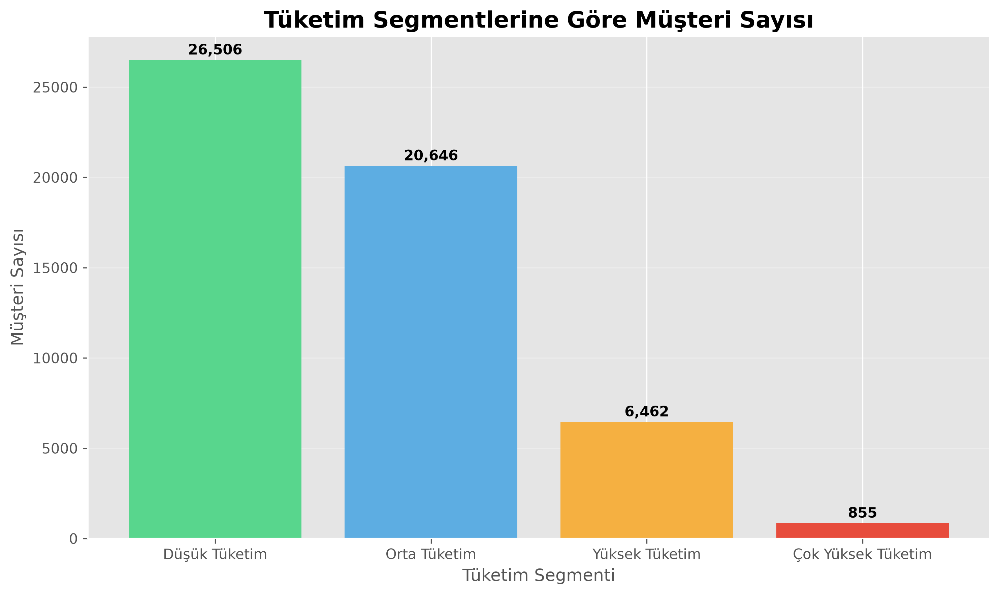
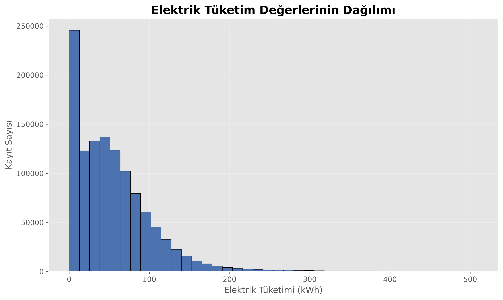
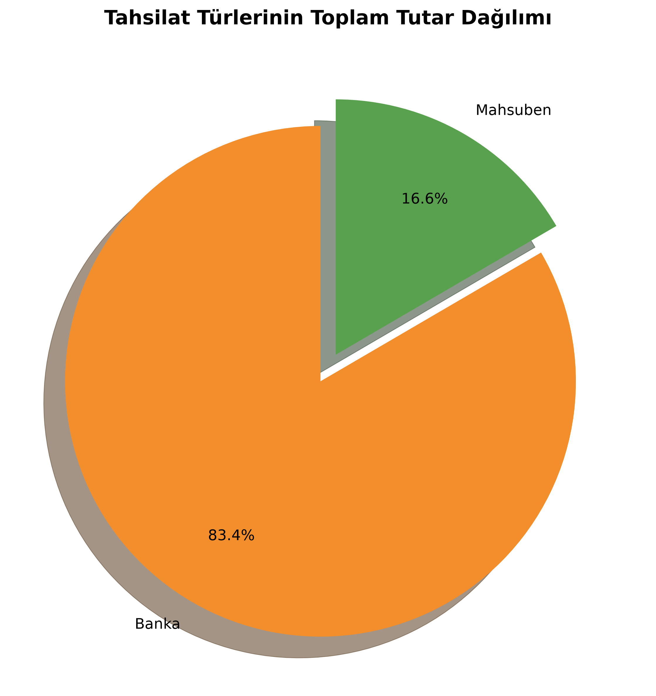

# ⚡ Energy Retail Data Analysis


---

## 📌 Project Overview

This project was developed as part of the **Ahmet Çalık Foundation Advanced Data Analytics Training Program**.

The study analyzes over **1.18 million electricity billing and collection records** using Python to identify electricity consumption patterns, customer behaviors, payment trends and operational insights.

---

## 🎯 Project Objectives

- Exploratory Data Analysis (EDA)
- Data Cleaning
- Data Visualization
- Customer Segmentation
- District-based Electricity Consumption Analysis
- Collection Performance Analysis
- Business Insights & Recommendations

---

## 📂 Project Structure

```text
Energy_Retail_Data_Analysis/
│
├── notebooks/
│   ├── notebook_01_veri_kesfi.ipynb
│   ├── notebook_02_gorsellestirme.ipynb
│   └── notebook_03_veri_hikayesi.ipynb
│
├── outputs/
│   └── figures/
│
├── README.md
├── requirements.txt
└── .gitignore
```

---

## 📒 Notebooks

### Notebook 01 — Exploratory Data Analysis

- Data Loading
- Data Cleaning
- Missing Value Analysis
- Descriptive Statistics
- Dataset Exploration

### Notebook 02 — Data Visualization

- Electricity Consumption Distribution
- District Comparison
- Customer Classification
- Collection Performance
- Payment Period Analysis

### Notebook 03 — Business Insights

- Customer Segmentation
- District Consumption Analysis
- Collection Performance Evaluation
- Data Storytelling
- Business Recommendations

---

## 📊 Dataset Summary

| Metric | Records |
|---------|--------:|
| Total Billing Records | **1,185,698** |
| Total Collection Records | **636,993** |
| Payment Timeline Records | **917,632** |

> **Note**
>
> The original dataset is **not included** in this repository because it exceeds GitHub's file size limit (100 MB) and is subject to sharing restrictions.

---

## 🛠 Technologies

- Python
- Pandas
- NumPy
- Matplotlib
- Jupyter Notebook

---

## 📈 Sample Visualizations

### Customer Segmentation



---

### Electricity Consumption Distribution



---

### Collection Performance



---

## 👨‍💻 Author

**Enes Doğan**

Management Information Systems Graduate

- GitHub: https://github.com/enesdogann
- LinkedIn: https://www.linkedin.com/in/enesdogaan/
